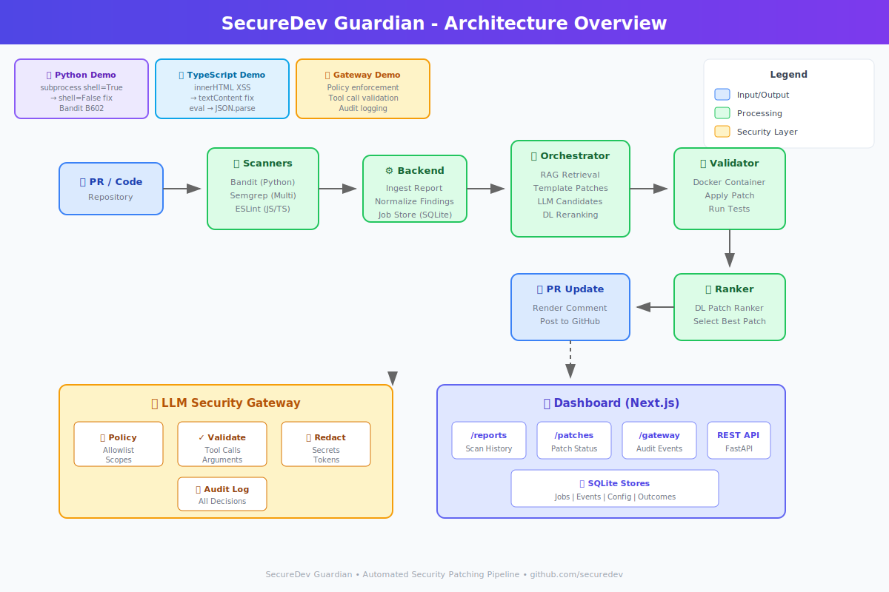

# SecureDev Guardian Demo Pack

This demo pack provides three self-contained demonstrations of the SecureDev Guardian pipeline:

1. **Python Demo** - Automated vulnerability detection and patching for Python code
2. **TypeScript Demo** - Security fixes for TypeScript/JavaScript applications
3. **Agent Gateway Demo** - Policy-based tool call validation and audit logging

## Quick Start

### Prerequisites

Run the prerequisite checker:

```bash
./demo_pack/scripts/check_prereqs.sh
```

Required:
- Python 3.11+ with virtualenv
- Git
- Node.js 18+ and npm (for TS demo and gateway)

Optional (enhances demo):
- Docker (for full validation; demos work without it)

### Setup

```bash
# One-time setup for all demos
./demo_pack/scripts/setup_all.sh
```

### Run Demos

Each demo takes about 1-2 minutes and produces deterministic output:

```bash
# Demo 1: Python vulnerability patching
./demo_pack/python_demo/run_demo.sh

# Demo 2: TypeScript vulnerability patching
./demo_pack/ts_demo/run_demo.sh

# Demo 3: Agent gateway policy enforcement
./demo_pack/agent_gateway_demo/run_demo.sh
```

## Architecture Overview



The pipeline flow:
1. **Scan Report** → Security scanner findings (Bandit, Semgrep) are ingested
2. **Orchestrator** → Generates patch candidates (deterministic templates + LLM)
3. **Validator** → Runs tests in isolated Docker container to verify patches
4. **Ranker** → Selects best validated patch using learned model
5. **Gateway** → Validates any tool calls against policy (audit logged)
6. **Dashboard** → Real-time visibility into jobs, patches, and audit events

## Demo Details

### Python Demo (`python_demo/`)
- **Vulnerability**: `subprocess.run(..., shell=True)` command injection risk
- **Fix**: Converts to safe `subprocess.run([...], shell=False)`
- **Validation**: Runs pytest to confirm behavior unchanged
- **Artifacts**: Diffs, validation reports, PR comment markdown

### TypeScript Demo (`ts_demo/`)
- **Vulnerability**: `innerHTML` XSS and unsafe `eval(JSON.parse(...))`
- **Fix**: `innerHTML` → `textContent`, `eval` → `JSON.parse`
- **Validation**: ESLint + TypeScript + Jest checks
- **Artifacts**: Diffs, validation reports, PR comment markdown

### Agent Gateway Demo (`agent_gateway_demo/`)
- **Allowed Call**: `fs.read` with valid path → ALLOWED
- **Blocked Call**: `shell.exec` (not in policy) → DENIED
- **Audit**: All decisions logged to `/api/v1/gateway/events`
- **Artifacts**: Decision JSON, audit log entries

## Expected Output

After running all demos, you'll find:
```
demo_pack/
  python_demo/outputs/<timestamp>/
    selected.diff
    validation_report.json
    pr_comment.md
    tests_output.txt
  ts_demo/outputs/<timestamp>/
    ...
  agent_gateway_demo/outputs/<timestamp>/
    allowed_decision.json
    denied_decision.json
    audit_events.json
```

## Troubleshooting

| Issue | Solution |
|-------|----------|
| Docker not available | Demos fall back to local validation (labeled in output) |
| npm not found | Install Node.js 18+ for TS demo and gateway |
| Permission denied | Ensure scripts are executable: `chmod +x demo_pack/**/*.sh` |
| Port 3000 in use | Dashboard UI optional; API/CLI outputs still work |

## Demo for Recruiters

Total time: ~5 minutes

1. Run `./demo_pack/scripts/setup_all.sh` (once)
2. Run each demo and observe:
   - Vulnerable code → Patched code transformation
   - Tests passing after patch
   - Gateway blocking unauthorized tool calls
3. Review the architecture diagram and artifacts
